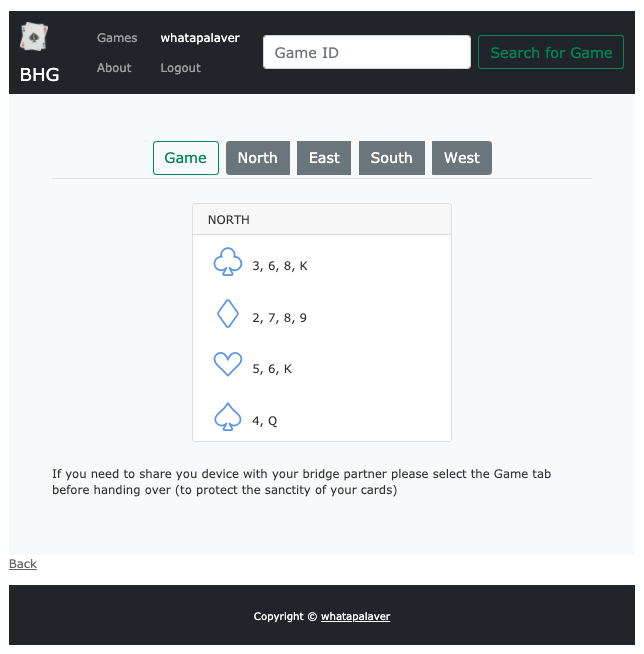

# BHG - (Contract) Bridge Hand Generator

NB. Still a Work In Progress

Inspired by a world in which 4 people are not allowed to gather around a table with a pack of cards.....

This is a Rails app which generates four hands and allow you to share the game code with friends far afield, so they can assemble their hands from disparate packs of cards.

## Working Version

Currently hosted on Heroku as [Bridge Hands Generator](https://bridge-hand-gen.herokuapp.com/).

## How to Run

- `bundle install`
- `npm install`
- `rake db:create`
- `rake db:migrate`
- `rake db:seed`
- `rails s`

## How to Test

to follow..

## How to Deploy

I've deployed my app to Heroku, [their guidance is excellent](https://devcenter.heroku.com/articles/getting-started-with-rails6) so I won't recreate it here.

...
